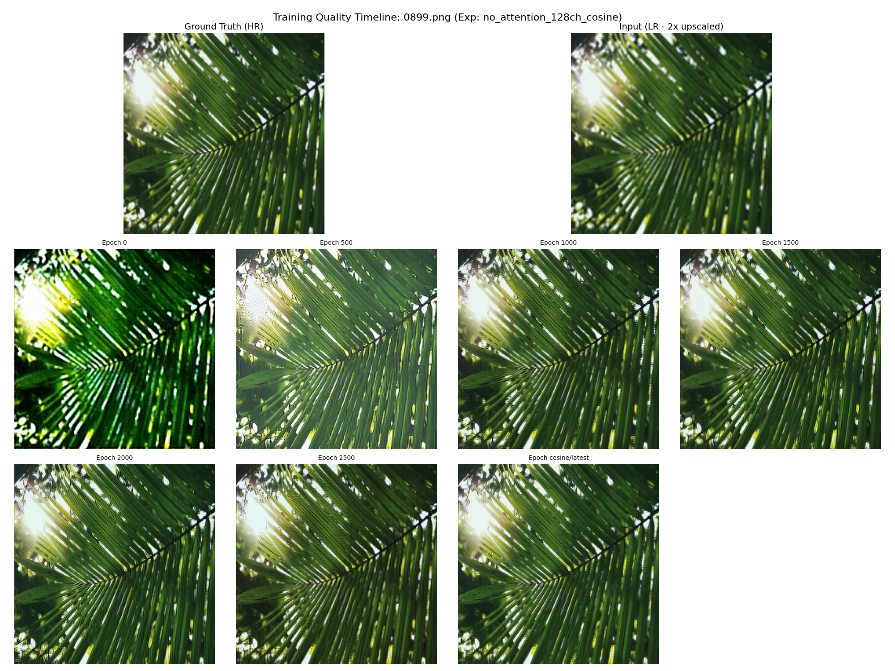
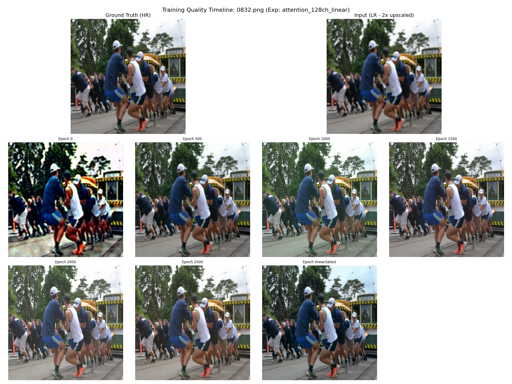

# Image Super Resolution using Diffusion models

This repo contains the source files for the Image Super Resolution project, utilizing conditional diffusion models.

## Deliverables (in the repo)
1. A working model/ A few working models
2. Model report
3. [Optional] Project presentation

## How to run
I highly recommend using a virtual environment in order to avoid conflicts with pre-existing libraries of different versions and in general.
```
python3 -m venv myenv
pip install -r requirements.txt
cd src
```
* Run `python3 prepare_data.py` to download the datasets locally, for training.
* Run `python3 train.py` to train the UNet model. 

The training file has a few parameters for training a specific model:
1. `experiment_name` - a custom name for the model that is about to be trained.
2. `channels` - the amount of kernels/channels in the initial/last convolutional layers of the U-Net.
3. `use_attention` - utilize self-attention in the model.
4. `schedule` - either linear or cosine.
5. `use_VGG` - utilize a frozen VGG network to tweak the objective function.

* Run `python3 sample.py` to run inference on all models inside the `experiments` directory, this will produce another sub-directory `images` with the generated results. 
* Run `python3 compare.py` to produce a timeline of PSNR and SSIM metrics for each sub-directory in `experiments`.

## Current project structure
``` bash
.
├── 🗎 README.md
├── 🗎 requirements.txt
├── 🗀 experiments
└── 🗀 src
    ├── 🗎 data.py
    ├── 🗎 diffusion.py
    ├── 🗎 model.py
    ├── 🗎 compare.py
    ├── 🗎 prepare_data.py
    ├── 🗎 sample.py
    └── 🗎 train.py
```

## Model Timeline Performance



