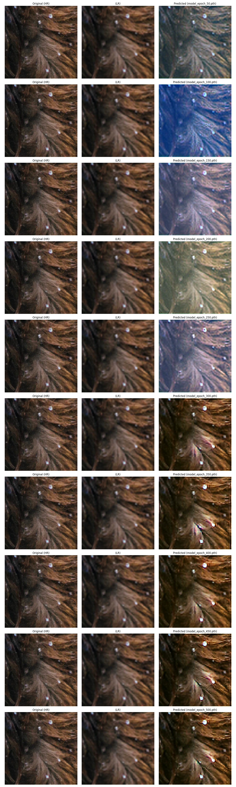

# Image Super Resolution using Diffusion models

In this repository I will document my progress on the super-resolution project.

## Deliverables (in the repo)
1. A working model/ A few working models
2. Model report
3. [Optional] Project presentation

## How to run
I highly recommend using a virtual environment in order to avoid conflicts with pre-existing libraries of different versions.
```
python3 -m venv myenv
pip install -r requirements.txt
cd src
```
Download datasets with
```
python3 prepare_data.py
```

Train the UNet model
```
python3 train.py
```

Test the trained models
```
python3 sample.py
```

## Current project structure
``` bash
.
├── 🗎 README.md
├── 🗎 requirements.txt
└── 🗀 src
    ├── 🗀 models
    ├── 🗎 data.py
    ├── 🗎 diffusion.py
    ├── 🗎 model.py
    ├── 🗎 comparison_plot_all_models.png
    ├── 🗎 prepare_data.py
    ├── 🗎 sample.py
    └── 🗎 train.py
```

## Most recent model performance
<span style="color:salmon">**At this point the model does not produce satisfactory results.**
</span>

